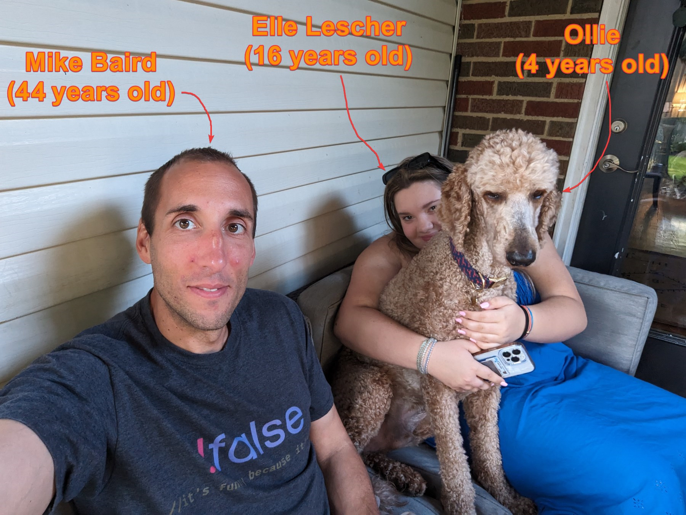
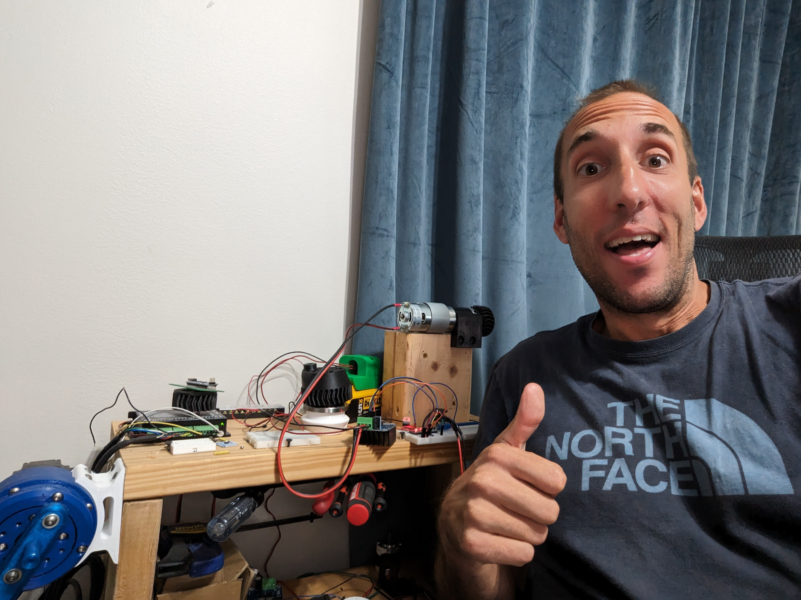
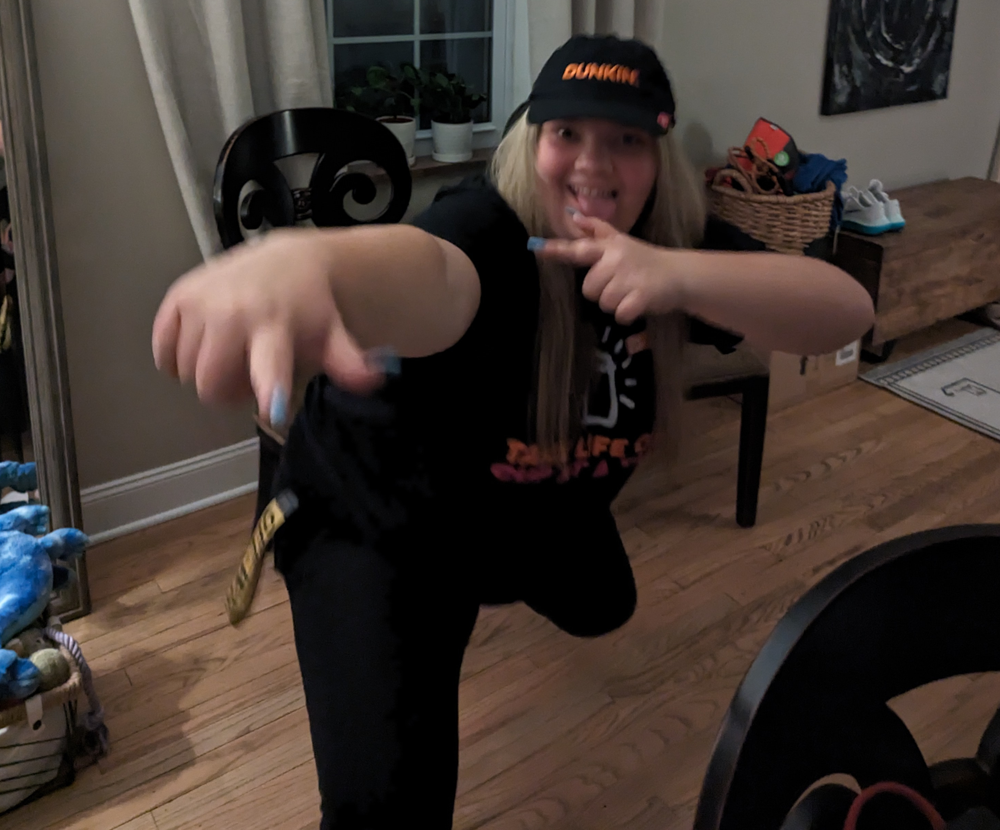

### What is the ***Product?***  ... Personalized Doggie Poop Bag Holders

You heard right, Dog Poop Bag Holders.  Sounds odd, but we think it may work cuz:

1. People ***love their pets***.  Consumer spending on pets outpaces inflation... it even outpaces healthcare cost growth
2. It's ***personalized*** with the owners pet name.  This is not something easily replicated at brick-and-morter pet retailers because it takes hours to 3d print
3. ***It's fun!***  this is the real reason I'm doing this.  We may never sell and single one, but I'll have fun with my neice on the journey
 

 

---

### Who are we?

#### Crazy Techie Uncle  
###### Mike Baird
I love  ***3d printing*** and ***dogs*** and ***startups/entrepreneurship***.  I've started robotics companies, construction companies, and play with tech for fun. One of my hobbies is CAD (Computer Aided Design) modeling and 3d printing a *doggie bag* holder for my dog Ollie (my good boy).  
A random pic of me with some geeky tech:

#### Energetic Neice 
###### Elle Lescher
My neice (Elle) likes ***e-commerce*** and ***marketing***.  Or maybe I just twisted her arm into starting an Etsy store.  Dunno.
What I do know is all 16 year old's like ***money***.  I may have lured her in with the idea of making a little.   Check out her flossing her swag from Dunkin Donuts (her first job to make money). 

---

### How's it made?
#### 3d Printed
We use cad modeling software ***Fusion 360*** and a ***Bambu Labs X Carbon*** 3d printer.  Video is easeir to understand than my rambling:
<Video
  width="100%"
  src="/images/3d-print-time-lapse-video_2023-09-21_20-25-50.mp4"
/>

 

---

### What about the 4 P's of marketing?
1. ***Product*** - doggie bag hoders as explained above
2. ***Pricing*** - $15 retail cost.  There are some competitors charging a similar price.  There are also many alternatives at lower price points.  Still, our product is better than many of the competitors (naturally we are a little biased) 
3. ***Promotion*** - we plan to sell the story of this being a 16 year old (and her old uncle's) passion project.  Admittadly, the best promotion is focused on the customer's need.  Things like offering discounts, two for one deals, differentiating features that wow the customer.... but, lets be honest, this is a dog poop bag holder.  There is not much to promote.  We likely will try different price points and promotion channels.
   - The 16 year old mentioned a in-person sales technique at the next pet fair in Cleveland, Ohio.  Meeting folks in person (***old school cool***) really helps to sell the story of a 16 year old working for ***college money***
4. ***Placement*** - Etsy.  At least to start.  Etsy is very competitive, we may never get any traction... but we'll have fun doing it.  Of course there are other channels like shopify and amazon fullfillment, but we're not sure there is sufficient demand to justify them.  Etsy is easy/quick to test the market

---
### Where is the Etsy link/store name?
##### This is next step in our jorney... check back for a ***link to Etsy COMING SOON!!!***
 